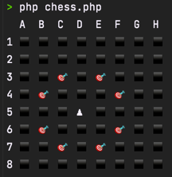
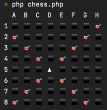
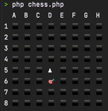
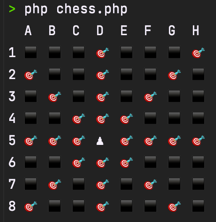
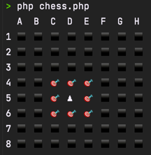
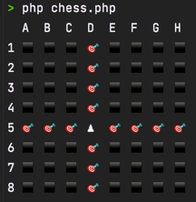

# TP chessboard Théo Delaporte

## Projet en php avec résultat des placements pour chaque pièces dans le cmd

- Le cavalier

- Le fou

- Le pion qui part du haut vers le bas (donc placement de départ sur ligne 2)

- La reine

- Le roi

- La tour

